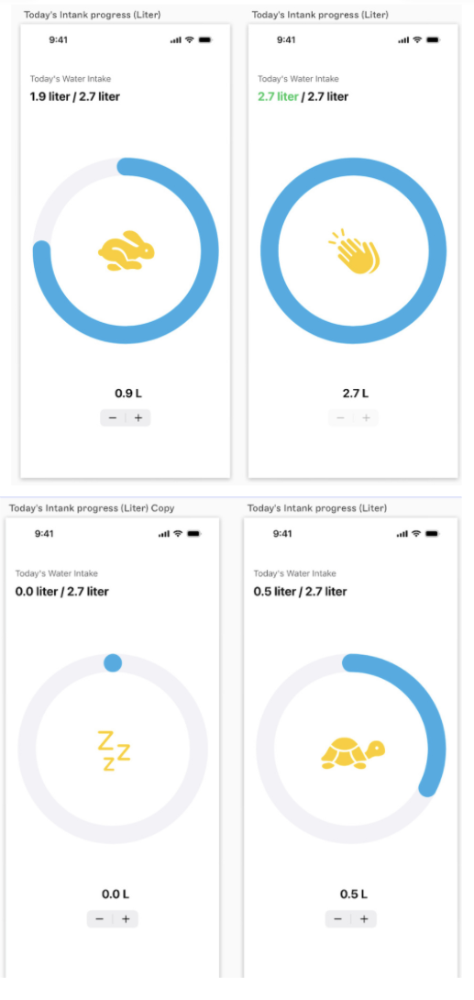

# 💧 Hydrate - Daily Water Tracker

**Hydrate** is a simple and intuitive water tracking app designed to help users stay hydrated throughout the day. The app allows users to manually log their water intake and receive reminder notifications to ensure they reach their daily hydration goal.

---

## 📱 Features

- 🚰 Track your water intake manually throughout the day  
- 🔔 Receive smart notifications to remind you to drink water  
- 🐢🐇 Fun animated icons that change based on your progress  
- 📊 Visual circular progress bar for easy tracking  
- 🧑‍🤝‍🧑 Designed for all age groups  
- 🌐 English-only interface for simple navigation  

---

## 🛠 Built With

- **SwiftUI** – for a smooth and responsive user experience  
- **Notification Center** – to schedule hydration reminders  
- **Custom Progress UI** – animated circular tracker with changing icons  

---

## 📸 App Preview

